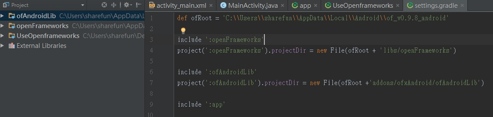

# 手動導入 Openframeworks 至現有的 APP (Android版)

## 簡述

[Openframeworks](openframeworks.cc)(OF)是一個開源的C++工具組，有跨平台的特性。團隊有專案在Openframeworks上開發，先前主要都是在Windows上開發，現在要將功能移植到APP上。

這篇主要是講移植到Android系統。Openframeworks提供給Android原生的函式庫，以Java Native Interface調用。並且還提供addon，為一個OFActivity，可以在這裡面使用OF的各種功能。

官方提供的方案只能從它們寫好的sample app開始一個專案，由於不想被OF綁死，所以我開始很痛苦的去看原生的各部份是如何組在一起的（只玩React native果然是要還的），以便將來可以再次拆出OF來。這篇文章就以一個Android空白專案為開始，最後可以用intent呼叫OFActivity。中間許多原理可能會跳過，僅說明步驟。

## 環境設定

基本的Android Studio和SDK、JDK的設定就略過，直接從NDK開始。NDK是讓Android專案可以調用C++或其他語言的工具。首先到[Android NDK頁面](https://developer.android.com/ndk/downloads/index.html)下載。要注意，因為OF官方說明，完整測過的NDK版本只有r10，所以要拉到最下面的archive下載r10版本來用。使用Android Studio雖然可以透過SDK Manager直接裝，但是無法裝舊版的。

下載完解壓後，設定環境變數`NDK_HOME=path_to_ndk_folder`並將此變數加入PATH。Windows下要設定的是`NDK_ROOT`。

打開SDK Manager，安裝LLDB和CMake。

再到OF官網下載OF for Android。

## 開新專案

保持簡單就好，這邊使用OF開一個UseOpenframeworks專案。


Mininum SDK不要選太高，確保可以向下相容。接下來因為我們會在Android原生的acitivity中intent給OFActivity，所以創一個初始的Activity，使用EmptyActivity即可。其他就照預設按Next。


再來把Project的結構改成從Android改成Project，結構會變成下圖。


因為沒有使用SDK Manager安裝NDK，所以須要手動設定NDK路徑。在 File > Project Structure ... 的SDK Location中，修改Android NDK Location欄位。


至此，專案完成。


## 引入OF

在settings.gradle中加入

```gradle
def ofRoot = 'path_to_your_of_folder'

include ':openFrameworks'
project(':openFrameworks').projectDir = new File(ofRoot + 'libs/openFrameworks')
```

並且sync，可以看到openFrameworks的原始碼被引入了。


繼續加入

```gradle
include ':ofAndroidLib'
project(':ofAndroidLib').projectDir = new File(ofRoot + 'addons/ofxAndroid/ofAndroidLib')
```

這是OF的Android package，之後可以直接將之實例化，放入AndroidManifest.xml中當作一個activity來用。如果是SDK Platform要更新，就點擊錯誤訊息更新即可。加入成功後如下圖



繼續加入

```gradle
include ':openFrameworksProject'
project(':openFrameworksProject').projectDir = new File(ofRoot + 'libs/openFrameworksCompiled/project/android')
```

這個是重點。引入並用gradle build時，會將OF原始碼建成可執行檔，並且會進入專案，將project_folder/src內的native code也建成.o檔。


上面`def ofRoot`要小心，windows和linux路徑表示方式不同，而最後一定要加`/`或`\\`才會正確進入該資料夾。

如果build失敗，OF提供一個技巧，在失敗的地方println xxx，然後在project folder將gradlew改成可執行檔，然後手動build，可以看到印出的訊息。這個就是對gradle不熟的我第一次習

沒意外的話，前兩步應該都可以正常運作。但是第三步因為牽涉到整個OF和本身專案的build，因此有許多問題。我們要改一下其中的一些設定，讓gradle可以成功build。再來就是痛苦的debug過程了。
得的技能。

首先在會先碰到的是找不到NDK路徑，雖然我們已經設定好了，但是它就是吃不到。為此，我們要改寫OF的內容。照官方說明，在libs/openFrameworksCompiled/project/android/paths.make裡改寫android NDK path。

在windows須要安裝MinGW的GCC編譯器才能compile，所以接著安裝MinGW，看[教學](http://blog.jex.tw/blog/2013/12/17/windows-install-gcc-compiler-mingw/)。

然後還要安裝[Make for Windows](http://gnuwin32.sourceforge.net/packages/make.htm)，讓windows看得懂Makefile。跟MinGW一樣，也要設定環境變數。

但是Windows編譯還是失敗...至此放棄Windows，以下只講Linux。

接著是build tool要更新成23.0.2以上。

```
app/build.gradle

buildtoolversion 23.0.2
```

在app/build.gradle加入compile project(':ofAndroidLib')

改openframeworkProject的gradle version

把下面換掉

```gradle
//    assembleDebug.dependsOn(":openFrameworksProject:compileDebugOF")

//    assembleRelease.dependsOn(":openFrameworksProject:compileReleaseOF")
tasks.whenTaskAdded { task ->
    if (task.name == 'assembleDebug') {
        task.dependsOn ':openFrameworksProject:compileDebugOF'
    }
}

tasks.whenTaskAdded { task ->
    if (task.name == 'assembleDebug') {
        task.dependsOn ':openFrameworksProject:compileReleaseOF'
    }
}
```

專案目錄下新增config.make，複製一份OF專案的config.make來用，修改OF_ROOT到正確的位置。也複製一份OF專案的jni的資料夾過來。

建好你的src在專案目錄下，並且放入ofApp.cpp, ofApp.h, main.cpp等檔案。如果有addons，請再加入addons.make，內容為你加入的addons。

如果有想要讓Native C code讀的檔案，可以在專案目錄下新增bin/data，在這裡的檔案可以被讀到。

在RN的預設狀況下，會同時編譯出armeabi-v7a和x86，要把x86停用才能正確開啟OF。

最後的app/build.gradle長這樣（以RN為例）

```
apply plugin: "com.android.application"

import com.android.build.OutputFile

/**
 * The react.gradle file registers a task for each build variant (e.g. bundleDebugJsAndAssets
 * and bundleReleaseJsAndAssets).
 * These basically call `react-native bundle` with the correct arguments during the Android build
 * cycle. By default, bundleDebugJsAndAssets is skipped, as in debug/dev mode we prefer to load the
 * bundle directly from the development server. Below you can see all the possible configurations
 * and their defaults. If you decide to add a configuration block, make sure to add it before the
 * `apply from: "../../node_modules/react-native/react.gradle"` line.
 *
 * project.ext.react = [
 *   // the name of the generated asset file containing your JS bundle
 *   bundleAssetName: "index.android.bundle",
 *
 *   // the entry file for bundle generation
 *   entryFile: "index.android.js",
 *
 *   // whether to bundle JS and assets in debug mode
 *   bundleInDebug: false,
 *
 *   // whether to bundle JS and assets in release mode
 *   bundleInRelease: true,
 *
 *   // whether to bundle JS and assets in another build variant (if configured).
 *   // See http://tools.android.com/tech-docs/new-build-system/user-guide#TOC-Build-Variants
 *   // The configuration property can be in the following formats
 *   //         'bundleIn${productFlavor}${buildType}'
 *   //         'bundleIn${buildType}'
 *   // bundleInFreeDebug: true,
 *   // bundleInPaidRelease: true,
 *   // bundleInBeta: true,
 *
 *   // the root of your project, i.e. where "package.json" lives
 *   root: "../../",
 *
 *   // where to put the JS bundle asset in debug mode
 *   jsBundleDirDebug: "$buildDir/intermediates/assets/debug",
 *
 *   // where to put the JS bundle asset in release mode
 *   jsBundleDirRelease: "$buildDir/intermediates/assets/release",
 *
 *   // where to put drawable resources / React Native assets, e.g. the ones you use via
 *   // require('./image.png')), in debug mode
 *   resourcesDirDebug: "$buildDir/intermediates/res/merged/debug",
 *
 *   // where to put drawable resources / React Native assets, e.g. the ones you use via
 *   // require('./image.png')), in release mode
 *   resourcesDirRelease: "$buildDir/intermediates/res/merged/release",
 *
 *   // by default the gradle tasks are skipped if none of the JS files or assets change; this means
 *   // that we don't look at files in android/ or ios/ to determine whether the tasks are up to
 *   // date; if you have any other folders that you want to ignore for performance reasons (gradle
 *   // indexes the entire tree), add them here. Alternatively, if you have JS files in android/
 *   // for example, you might want to remove it from here.
 *   inputExcludes: ["android/**", "ios/**"],
 *
 *   // override which node gets called and with what additional arguments
 *   nodeExecutableAndArgs: ["node"]
 *
 *   // supply additional arguments to the packager
 *   extraPackagerArgs: []
 * ]
 */

apply from: "../../node_modules/react-native/react.gradle"

/**
 * Set this to true to create two separate APKs instead of one:
 *   - An APK that only works on ARM devices
 *   - An APK that only works on x86 devices
 * The advantage is the size of the APK is reduced by about 4MB.
 * Upload all the APKs to the Play Store and people will download
 * the correct one based on the CPU architecture of their device.
 */
def enableSeparateBuildPerCPUArchitecture = false

/**
 * Run Proguard to shrink the Java bytecode in release builds.
 */
def enableProguardInReleaseBuilds = false

android {
    compileSdkVersion 23
    buildToolsVersion "23.0.2"

    defaultConfig {
        applicationId "com.theia"
        minSdkVersion 16
        targetSdkVersion 22
        versionCode 1
        versionName "1.0"
        ndk {
            // abiFilters "armeabi-v7a", "x86"
            abiFilters "armeabi-v7a"
        }
    }
    splits {
        abi {
            reset()
            enable enableSeparateBuildPerCPUArchitecture
            universalApk false  // If true, also generate a universal APK
            // include "armeabi-v7a", "x86"
            include "armeabi-v7a"
        }
    }
    buildTypes {
        release {
            minifyEnabled enableProguardInReleaseBuilds
            proguardFiles getDefaultProguardFile("proguard-android.txt"), "proguard-rules.pro"
        }
    }
    // applicationVariants are e.g. debug, release
    applicationVariants.all { variant ->
        variant.outputs.each { output ->
            // For each separate APK per architecture, set a unique version code as described here:
            // http://tools.android.com/tech-docs/new-build-system/user-guide/apk-splits
            // def versionCodes = ["armeabi-v7a":1, "x86":2]
            def versionCodes = ["armeabi-v7a":1]
            def abi = output.getFilter(OutputFile.ABI)
            if (abi != null) {  // null for the universal-debug, universal-release variants
                output.versionCodeOverride =
                        versionCodes.get(abi) * 1048576 + defaultConfig.versionCode
            }
        }
    }

    sourceSets {
        main {
//            manifest.srcFile 'AndroidManifest.xml'
            jni.srcDirs = []
            java.srcDirs = ['src/main/java']
            jniLibs.srcDirs = ['../libs']
            println "Yes read libs----------------------------------"
//            resources.srcDirs = ['srcJava']
//            aidl.srcDirs = ['srcJava']
//            renderscript.srcDirs = ['srcJava']
//            res.srcDirs = ['res']
//            assets.srcDirs = ['assets']
        }
    }
}

dependencies {
    // Openframeworks
    compile project(':ofAndroidLib')

    // React Native and native
    compile project(':react-native-image-picker')
    compile project(':react-native-i18n')
    compile project(':react-native-vector-icons')
    compile project(':react-native-device-info')
    compile project(':react-native-config')
    compile fileTree(dir: "libs", include: ["*.jar"])
    compile "com.android.support:appcompat-v7:23.0.1"
    compile "com.facebook.react:react-native:+"  // From node_modules
}

// Run this once to be able to run the application with BUCK
// puts all compile dependencies into folder libs for BUCK to use
task copyDownloadableDepsToLibs(type: Copy) {
    from configurations.compile
    into 'libs'
}

// Openframeworks implement
clean.dependsOn(":openFrameworksProject:clean")

tasks.whenTaskAdded { task ->
    if (task.name == 'assembleDebug') {
        task.dependsOn ':openFrameworksProject:compileDebugOF'
    }
}

tasks.whenTaskAdded { task ->
    if (task.name == 'assembleDebug') {
        task.dependsOn ':openFrameworksProject:compileReleaseOF'
    }
}
```

然後NDK會試著透過openFrameworksCompiled的內容來build我們的src，由於RN專案有太多檔案，導致search path過長，所以又要改一下openFrameworksCompiled的設定，只要看log就知道應該改哪裡了，限於篇幅就不贅述。

總之，不使用OF提供的方案去使用，而要自己用Native去包它的話，是很麻煩的，在Android上最後還是有成功（使用intent和URL Scheme），但不穩定，常會crash，在iOS則是直接失敗。