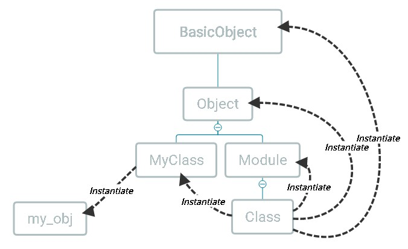
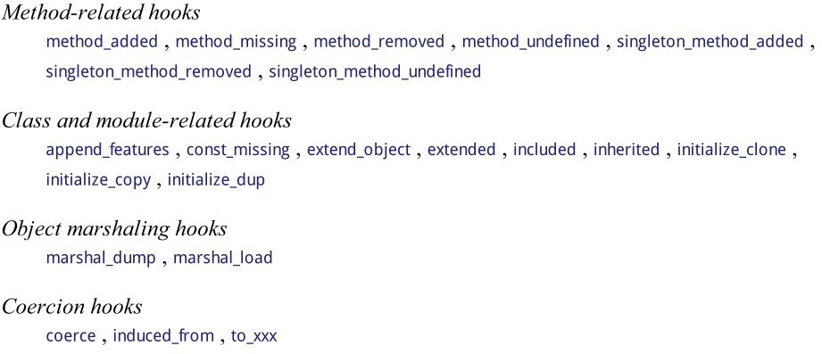

<!-- TOC -->

- [Metaprogramming in Programming Ruby](#metaprogramming-in-programming-ruby)
    - [Object and Class](#object-and-class)
        - [self的幾個用途](#self的幾個用途)
        - [self in class object](#self-in-class-object)
    - [Singletons](#singletons)
        - [Reopen singleton class](#reopen-singleton-class)
    - [Module and Mixins](#module-and-mixins)
    - [Class-level Macros](#class-level-macros)
    - [Class Method and Modules](#class-method-and-modules)
    - [Tow Other Forms of Class Definition](#tow-other-forms-of-class-definition)
        - [第一種](#第一種)
        - [第二種](#第二種)
    - [instance_eval and class_eval](#instance_eval-and-class_eval)
    - [Hooked Methods](#hooked-methods)
        - [inherited](#inherited)
        - [method_missing to simulate accessors](#method_missing-to-simulate-accessors)
        - [method_missing as a filter](#method_missing-as-a-filter)

<!-- /TOC -->

# Metaprogramming in Programming Ruby

本篇文章是Programming Ruby第三部份關於meataprogramming的讀書筆記，幫助整理思路。

筆者的學習經驗中，直接進Metaprogramming Ruby感覺比較吃力，有一些卡關的觀念是看了這章後才豁然開朗的。如果讀者讀Metaprogramming Ruby碰壁，可以考慮先讀Programming Ruby的這一章。

## Object and Class

除了block，Ruby中萬物皆物件。Ruby中沒有真正的類，Ruby的類宣告其實全等於初始化一個類別物件，並指派給一個常數。

```
class MyClass; end

# Behind the hood
MyClass = Class.new
```

對Ruby來說，類只是物件的一種而已。

`Object`包含 flag (object.object_id)，實例變數，和關聯到的 class。

`Class`因為也是object，所以包含上面所有，再加上一些（實例）方法和關聯到的superclass。



因為類也是物件，所以我們常見到的class method其實不存在`class`中，而是存在其產生的`singleton class`中作為實例方法而存在。當我們為一個類新增class method，就會產生一個中繼class存放這個方法，並且當前的物件的類變成此中繼class。稍後會有更詳細的說明。

### self的幾個用途

`self`指的是當前object，如果沒有explicit receiver，`self`不會變化。

1. 用來控制Ruby找其實例變數。
2. 當沒有explicit receiver時，會以`self`作為receiver。
3. 當有explicit receiver時，`self`會被設定為該object。

### self in class object

當使用class關鍵字時，會將`self`設為此class object，在class定義的上下文中，`self`總是被設為此class object。

## Singletons

每當為一個object建立一個實例方法時，它會產生一個anonymous class (singleton class)，object會成為該class的實例，而object原本的class會變成此class的parent class。

由於class也是object，當我們在class內使用`self.xxx`時，也是在為class object建立實例函數，故也會產生新的singleton class，繼承於原本的class，當前的class也會變成該singleton class的實例。

### Reopen singleton class
```ruby
class << your_object   # 打開your_object的singleton class
  def xxx              # 為your_object定義instance method
  end
end
```
Ruby會禁止你用singleton class建新的實例，這是取名singleton class的原因。

## Module and Mixins

`include`是在class內才可以使用的方法。Include module目的是在class中增加一些instance methods。（但也可以增加class method，而且其實有被大量使用，所以不能從include判斷是否是增加instance method還是class method）在class裡include module就像是為這個class新增一個superclass，存放一些instance method。

實踐上，當include module時，Ruby會建一個新暱名的class object，當前class的superclass指向它，而新的暱名class object的superclass指向原class的superclass。此暱名class本身並不帶instance method，要作函數找查時，它會指向module要函數。如此才可以做到隨意插入module至class中而不會造成繼承樹的錯亂。但也有一個問題，就是一旦改動module，所有include此module的都會立即改變。

Ruby在物件的繼承鏈中只能被include一次。

prepend也是類似，只不過與原class的繼承關係相反。

`extend`是物件的方法，任意物件都可以使用。Extend module是針對特定object增加instance methods，因此不會被其他instance共享。

如果在class中extend module，則會創建class methods。因為class裡的self就是class本身。

簡言之，include和prepend會為class增加instance methods，而且其所有的instance皆可使用。相對的，extend直接對object增加instance method，最class則會增加class-level instance method (kind of class method)，且只有該object可以使用。

## Class-level Macros

這裡解釋attr_accessor, has_many這類的class method是如何實現的。

先從一般object開始。當我使用`obj.method`的時候，Ruby會將`self`設為`obj`，然後到`obj`所屬的class的instance methods中尋找，如果找不到，就再往其superclass中尋找，這中間當然也包括所有prepend和include的module。

對class而言亦然。在child class中呼叫class method時，如果不存在，它就會往其superclass找class method。

has_many和attr_accessor這類的magic就是這樣泡製出來的。我們只是只是輸入一些方法名，它就自動幫你生出相對應的函數。

書中舉例

```ruby
class People
  def self.say_hi
    def say_hi(foo)
      "hihi " + foo
    end
  end
end

class Engineer < People
  say_hi
  # or self.say_hi("Yooo!")
end

Engineer.new.say_hi("xxx")
```

在Enginner裡執行 self.say_hi，self 是 Engineer，找不到該方法，所以會往其 parent 找，在 People 找到該方法並執行，因此 Engineer 可以得到一個 instance method，存在People。這在Engineer定義完成時就會生成（因為逐行執行，只有函數內的東西在生成時不會被執行）。往後 Engineer 的任何實例都可以使用實例方法 say_hi 了。

這樣就可以理解 has_many 這樣的類方法是怎麼使用的了。say_hi 換成 has_many，"Yooo!"換成 DB 欄位的參數，就可以讓新的 model 實例生成後就能使用一系列的實例方法了。

不過，當使用 has_many 時，我們是依據參數內容產生不同名的實例方法，這意味著要動態的生成方法，我們可以使用define_method 做到這點

```ruby
module ActiveRecord
  class Base                           # 類比ActiveRecord::Base，實現has_many
    def self.has_many(things)
      define_method(things) do         # 如果即將定義的實例方法有參數，加在do的後面
        "There are your " + things
      end
    end
  end
end

class Factory < ActiveRecord::Base
  self.has_many "cars"
end

Factory.new.cars                       # 因為has_many後面接了cars，所有實例自動會有cars方法，這是在定義Factory時就產生的
#=> "There are your cars"              # 執行cars方法得到的結果
```
值得注意的一個細節是，define_method永遠只會產生instance_method，不論是在class_exec中或是instance_exec中。

## Class Method and Modules

有更多時候，我們的class已經繼承其他class，因此無法再繼承其他class。這時可以把這些方法寫進module，使用extend module為class新增類方法，類方法的內容就類似上面的self.has_many。

如果同時有class method和instance method要加進一個class，不能用簡單的使用extend。這時我們會須要使用一個rails極常使用的pattern：ruby的hook method `included`，此方法在你**include module到class時會自動調用**。

直接上demo code。

```ruby
module MyModule
  # include 後會成為 instance method
  def my_instance_method
  end

  # 用 module 包住 class method，慣例上 module 名為 ClassMethods
  module ClassMethods
    # include後會成為class method
    def my_class_method
    end
  end

  # 當有 class include 此 module 時 extend 該 class
  def self.included(host_class)
    host_class.extend(ClassMethods)
  end
end

class Example
  include MyModule
end

Example.my_class_method
Example.new.my_instance_method
```

## Tow Other Forms of Class Definition

### 第一種

```ruby
class A < B
end
```
B可以換成任何回傳一class object的東西，比方`Struct.new`會回傳一個class object，所以也可以寫成像

```ruby
class A < Struct.new(:name, :age)
end
```

### 第二種

```ruby
SomeClass = Class.new do
  def some_method
  end
end

SomeClass.new
```

## instance_eval and class_eval

Object#instance_eval, Module#class_eval, Module#module_eval 讓我們可以將 `self` 設定為任意 object，執行 block 內容後，再將 `self` 指回原本的 object

```ruby
"Yoo".instance_eval { self.upcase }
#=> "YOO"

# 定義 class method
class A; end
A.instance_eval do
  def say_hello
    puts "Hello!"
  end
end

A.say_hello
```

class_eval 也如同 instance_eval，只不過它多設定了可以定義方法的環境，就像 reopen class 一樣。
```ruby
# 定義 instance method
class A; end
A.class_eval do
  def say_hi
    puts "Hi!"
  end
end
A.new.say_hi
#=> Hi!
```

Object#instance_exec, Module#class_exec, Module#module_exec 讓我們可以額外送進別的object當參數，放於 block 的參數中。

Constant lookup 在 eval 中是看 lexical 環境。

## Hooked Methods

hooked methods == callbacks

被解釋器自動調用的方法。在 Ruby 中是以名稱去找的，如果你有定義同名函數，就會執行之。下表是書中所列的 hooked methods



### inherited

在有別的 class 繼承於當前 class 時被調用，參數為 child class

```ruby
class Parent
  def self.inherited(child)
    puts "Some class inherited from this"
  end
end

class Child < Parent
end

#=> Some class inherited from this
```
### method_missing to simulate accessors

完整參數：`def method_missing(name, *args, &block) ...`

以下簡化書中範例，自己寫一個只讀的 OpenStruct，。繼承於 BasicObject 以獲得最少的實例方法。我附上註解。
```ruby
class MyOpenStruct < BasicObject
  def initialize(initial_values = {})
    @values = initial_values    # MyOpenStruct的實例變數是一個hash
  end
  def _singleton_class
    class << self               # 新增一個MyOpenStruct的singleton class
      self                      # 並且回傳該singleton class
    end
  end

  def method_missing(name, *args, &block)
    _singleton_class.instance_exec(name) do |name|    # 找不到方法時，在singleton中新增實例方法
      define_method(name.to_sym) do
        @values[name]
      end
    end
    @values[name] + 3
  end
end

struct = MyOpenStruct.new(x:3)
struct.x  #=> 6   # 會傳到 method_missing
struct.x  #=> 3   # 第二次調用時，因為該方法在method_missing中已經被定義，所以直接調用該方法
```

繼承BasicObject看起來是使用method_missing的好方法，但是因為缺少很多常用方法，它帶來的壞處可能比好處更多。

### method_missing as a filter

用method_missing去定義所有方法是不實際的。像ActiveRecord::Base是用regular expression去過濾方法，不符合的就會調用parent的method_missing。