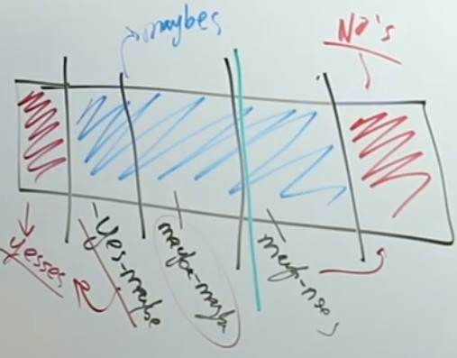
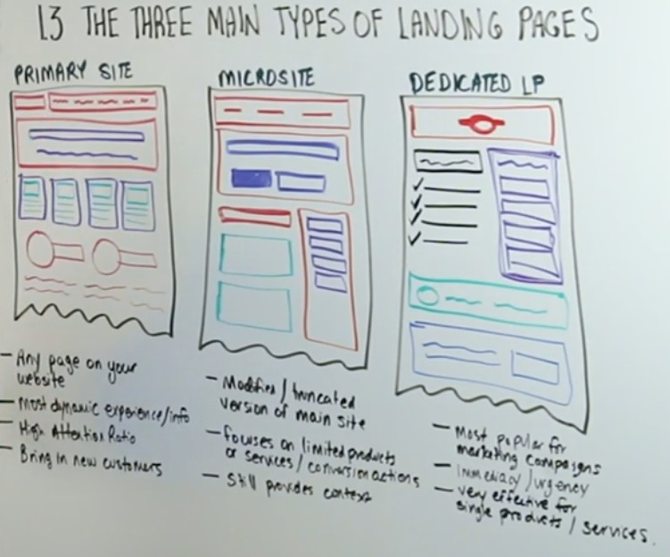
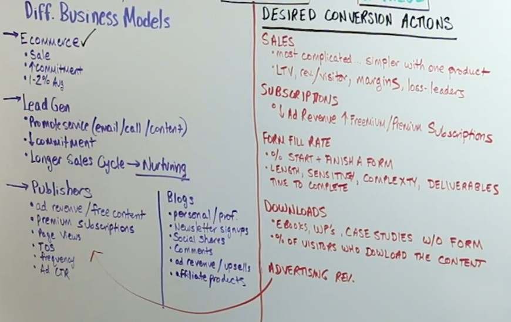
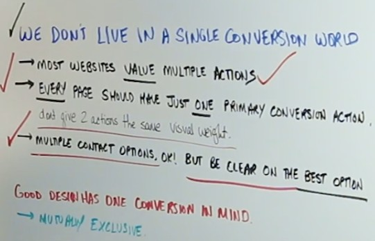
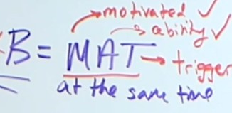
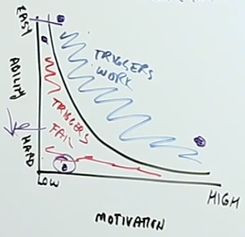
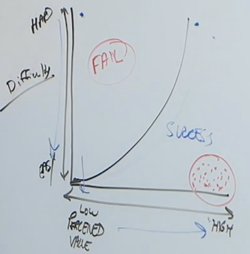

- [[第一章] Landing Page Design and Optimization Fundamentals](#第一章-landing-page-design-and-optimization-fundamentals)
    - [Landing page定義及其內容重點](#landing-page定義及其內容重點)
        - [五秒測試](#五秒測試)
    - [轉換率須知](#轉換率須知)
    - [三種 Landing Page](#三種-landing-page)
    - [常見的 Business Model 並理解你的 Conversion Actions](#常見的-business-model-並理解你的-conversion-actions)
    - [AIDA Sale Funnel and Decision Making Process](#aida-sale-funnel-and-decision-making-process)
        - [4 main conitive phase](#4-main-conitive-phase)
        - [AIDA to website visitors](#aida-to-website-visitors)
        - [Awareness Stage](#awareness-stage)
        - [Interest Stage](#interest-stage)
            - [person-based selection](#person-based-selection)
            - [need-based selection](#need-based-selection)
            - [Preference Test](#preference-test)
        - [Desire Stage](#desire-stage)
            - [此階段常見的活動](#此階段常見的活動)
        - [Action Stage](#action-stage)
    - [Fogg Behavior Model](#fogg-behavior-model)
        - [Motivation](#motivation)
        - [Ability](#ability)
        - [Trigger](#trigger)
    - [Making It Memorable](#making-it-memorable)
        - [Limbic System (邊緣系統)](#limbic-system-邊緣系統)
        - [The Way We Learn](#the-way-we-learn)
- [[第二章] The Primay of Product and the Concept of Usability in Landing Page Design](#第二章-the-primay-of-product-and-the-concept-of-usability-in-landing-page-design)
    - 

# [第一章] Landing Page Design and Optimization Fundamentals

## Landing page定義及其內容重點

Landing Page Definition: 1st page toward conversion goal

* Clarity - the most important element in landing page design
* Request for fewer question marks

### 五秒測試

選一張網站上的關鍵圖(remove brand recognition)給不熟悉該品牌的人看五秒，之後問三個問題（若移除了所有品牌名稱，就略過第一個問題）

1. 公司的名字
2. 公司賣什麼
3. 公司提供什麼價值給使用者

## 轉換率須知

三種訪客

1. Noes（付不起，只是隨意亂逛來的）
2. Yeses（對品牌高度認同，不管流程做得再爛也會買單的，但這種人比例很少）
3. Maybes（搖擺中，對品牌認同還不夠強的，這是***Landing page最佳化所希望吸引的目標***）

更明確的說，設計最佳化不是針對Yeses，而是針對Yes-Maybe和Maybe-Maybe。Ceiling是Maybe-Maybe和No-Maybe的交界處。

## 三種 Landing Page

左圖是一般的主頁，有豐富且完整的資訊和連結。**主要用在增加engagement和awareness**。

中圖是簡化版的主頁，只顯示部份業務內容。

右圖是典型的LP，只專注在一件事上，就是要使用者做一件事，訴求**明確**，**即時**。沒有其他多餘的連結，只有一個主logo，也沒有hero。**對銷售週期短的宣傳活動特別有用**。

Attention Ratio = 點擊到購買的連結(完成conversion action) / 頁面上所有連結

這三種主要彰顯的要點是，如果網頁上有太多分心的圖案或連結，使用者就愈容易分心。所以AR愈高，幾乎可以決定轉換率愈高。網頁仍然要放有足夠的資訊，但對於促成轉換率無助益的東西就應該拿掉。不過並不代表左邊的就是不好的Landing Page，這取決於你的訴求為何。

## 常見的 Business Model 並理解你的 Conversion Actions

Conversion = **Action** that is **measurable** + has **a value**

## AIDA Sale Funnel and Decision Making Process

### 4 main conitive phase

1. Awareness
2. Interest
3. Desire
4. Action

前三者是extrinsic stimuli。最後是natrual result。

這四層組成一個funnel cycle。以買車和買耳機為例，說明不同產品走這些cycle的變化是很大的。而且走完到Action後，使用者會再回退回funnel上一層或上多層。

### AIDA to website visitors

| AIDA | Web |
|---|---|
| Browsers | awareness |
| Evaluators (take note, compare) | interest |
| Transactors (add to cart) | desire |
| Customers | action |

在這四階中，使用者心中會問的問題是

1. Do you have what I want? （五秒測試中的公司在賣什麽）
2. Why buy from you? （五秒測試中的公司提供什麽價值）

**生活經驗中，可以觀察自己在購買東西的過程中，是如何轉化的？是看到什麽？特價？實用？新奇？觀察自己在每一階如何轉化至下一階，並將其應用到自己的頁面上。**

### Awareness Stage

Interest, Desire相對來說容易轉換，此階段則是使用者對產品還陌生的時候，故要能有效的吸引使用者注意力。

- Spreading awareness should be don via permission marketing, **trading free value for engagement and attention** (以免費的價值來吸引注意力)
- New visitors are low on commitment and are looking for **reassureance, value and clarity**（安心，價值，明確）

> 訊息耗損接收者的注意力。愈豐富的訊息會使得注意力愈發貧乏，因而須要有效的將注意力定位到過度豐富的訊息中。
（所以在Landing page中放的連結不宜過多，是一樣的道理。）

- Be still, calm，過多動畫或花俏的特效反直覺的會趕走使用者。只強調真正須要強調的東西，使東西容易找。
- 所有次要action都會自動削弱主要action，所以主要的一定要比次要顯眼。
- Genearating awareness is about capturing attention **quickly, effectively, clearly, succinctly.**
- 整理所有元素，使用空白給出一種階層感和可讀性
- 清楚的標題和副標
- 清楚的行動按鈕（後述）

（搭配講義看Landing page好壞的範例，不用擔心簡單得像是網頁初學者一樣，明確，是此階段最重要的事）

### Interest Stage

- 比較接近Awareness而不是Desire
- 有可能因為Landing page上的特定區塊而短暫達到這個階段
- 不可能說服人對你的產品感興趣，這是自我選擇的（行銷是用在後兩階段）

#### person-based selection

給人自我辨別（依據角色或職位），比如網站提供全職區域和兼差區域給使用者自行選擇，給使用者明確的指示可以往哪裡看更多資訊

（person-based通常比較好，但仍是視產品而定）

#### need-based selection

讓使用者依需求選擇，提供相關的內文資訊來引起興趣

#### Preference Test

給使用者看兩種網頁設計，給他們較長時間。給他們特定的指導和說明（who確定對象, what喜歡哪個, why為什麼），說這兩版的差異在哪裡。此測試可以對明確性做客觀的衡量，針對單一頁面可以用此測出較有效的設計。（可以是測logo，顏色主題，標題，或Call-to-action）

（範例中說明只是將雲端計算的分類主標題從need-based改為person-based，兩者受親睞的程度為14:86）

### Desire Stage

此階段的使用者對你的產品有更高度的認同，也準備給你更多時間和注意力。但不代表可以迫使他們購買。須要確保給予足夠的支援資訊。使用者在此階段從scanning轉成reading。

- **都跟trust和secure有關**。
- 當使用者要向你買單時，他們會尋找交易保證和社群保護。
- 再一次，使用者應該有權決定他跟你品牌間的關係進行的方向和步調，所以不要催促他。

#### 此階段常見的活動
- 有關feature的重要性要優先顯示，之後再用圖表去輔助，層層深入
- 競爭者分析，表現出優於競爭者的地方
- 社群認同，相同情境的使用者會更容易因為其他使用者的正向評價買單（後述）

### Action Stage

- 不管是在contact form或checkout process，不要讓使用者填寫**任何**不必要的欄位
- 簡單至上，簡化選擇，移除無關的分心物，省略不必要的字
- 避免驚訝(avoiding surprises)，不要問人還要不要買別的，不要讓別人填別的表單

## Fogg Behavior Model

**B = MAT** (at same time)

Behavior = Motivation Abitility Tigger at the same time

### Motivation

1. sensation (感情的)
2. anticipation (預期的)
3. social***

### Ability

增加simplicity，就增加使用者的ability，proceed difficulty (PD)下降。

### Trigger

Facilitator: M↑ PD↓ >> 降低進入門檻（以買車為例，是有高度motivation，但門檻很高，可以分期或減配等等）

Signals: 

Sparks: M↓ PD↑ >> 適當給與獎勵（以訂閱電子報為例，因為很簡單，要驅使人訂購，就須提供較好的優惠）

## Making It Memorable

### Limbic System (邊緣系統)

- 2nd part of the brain to evolve
- responsible for emotion, attention, affective responses + memories
- Value judgements
- Avoid pain / pursues pleasure
- Spontaneous behavior

好的設計就是要進入 limbic system。我們要在情感和心理面使使用者產生信任感。雖然我們的設計都是基於科學和統計的，但最後是要讓使用者在情感面和情緒面接受我們的產品。

### The Way We Learn

modalities

- Visual: imagery, color, tables, infographics, videos, tours （滑板使用說明）
- Audio: voice-overs, music, video, telephone
- Kinesthetic: quizzed, games, role-playing （使用互動幫你配色/傢俱擺設）

這些不應該干擾好的設計，也不是說要硬加這些元素上去，而是增強體驗用的。這在Desire/Interest階段特別重要。這些東西應該是在使用者須要更多內容或協助時才出現的。

# [第二章] The Primay of Product and the Concept of Usability in Landing Page Design

## Usability

物品類和諮詢類各自有不同的 usability。諮詢類要強調成效，可以顯示有多少人使用過有成效；物品類往往可以在別處找到，所以你能提供的價值可能就是給予售後服務或是較低廉的價格。

> Usability: A person of average ability and experience can figure out what you do and how to use your website without it being more trouble than it's worth.

好的設計會增加 proceed value 並降低使用難度，讓使用者落在右下角，此時轉換率才能最大化。

## Clarity

### clarity 和 simplicity 是為了減少 thought

- Don't Make Me Think
- Things should be self evident. If not, then self explanatory