- [[第一章] Landing Page Design and Optimization Fundamentals](#第一章-landing-page-design-and-optimization-fundamentals)
    - [Landing page定義及其內容重點](#landing-page定義及其內容重點)
        - [五秒測試](#五秒測試)
    - [轉換率須知](#轉換率須知)
    - [三種 Landing Page](#三種-landing-page)
    - [常見的 Business Model 並理解你的 Conversion Actions](#常見的-business-model-並理解你的-conversion-actions)
    - [AIDA Sale Funnel and Decision Making Process](#aida-sale-funnel-and-decision-making-process)
        - [4 main conitive phase](#4-main-conitive-phase)
        - [AIDA to website visitors](#aida-to-website-visitors)
        - [Awareness Stage](#awareness-stage)
        - [Interest Stage](#interest-stage)
            - [person-based selection](#person-based-selection)
            - [need-based selection](#need-based-selection)
            - [Preference Test](#preference-test)
        - [Desire Stage](#desire-stage)
            - [此階段常見的活動](#此階段常見的活動)
        - [Action Stage](#action-stage)
    - [Fogg Behavior Model](#fogg-behavior-model)
        - [Motivation](#motivation)
        - [Ability](#ability)
        - [Trigger](#trigger)
    - [Making It Memorable](#making-it-memorable)
        - [Limbic System (邊緣系統)](#limbic-system-邊緣系統)
        - [The Way We Learn](#the-way-we-learn)
- [[第二章] The Primay of Product and the Concept of Usability in Landing Page Design](#第二章-the-primay-of-product-and-the-concept-of-usability-in-landing-page-design)
    - 

# [第一章] Landing Page Design and Optimization Fundamentals

## Landing page定義及其內容重點

Landing Page Definition: 1st page toward conversion goal

* Clarity - the most important element in landing page design
* Request for fewer question marks

### 五秒測試

選一張網站上的關鍵圖(remove brand recognition)給不熟悉該品牌的人看五秒，之後問三個問題（若移除了所有品牌名稱，就略過第一個問題）

1. 公司的名字
2. 公司賣什麼
3. 公司提供什麼價值給使用者

## 轉換率須知

三種訪客

1. Noes（付不起，只是隨意亂逛來的）
2. Yeses（對品牌高度認同，不管流程做得再爛也會買單的，但這種人比例很少）
3. Maybes（搖擺中，對品牌認同還不夠強的，這是***Landing page最佳化所希望吸引的目標***）

更明確的說，設計最佳化不是針對Yeses，而是針對Yes-Maybe和Maybe-Maybe。Ceiling是Maybe-Maybe和No-Maybe的交界處。

## 三種 Landing Page

左圖是一般的主頁，有豐富且完整的資訊和連結。**主要用在增加engagement和awareness**。

中圖是簡化版的主頁，只顯示部份業務內容。

右圖是典型的LP，只專注在一件事上，就是要使用者做一件事，訴求**明確**，**即時**。沒有其他多餘的連結，只有一個主logo，也沒有hero。**對銷售週期短的宣傳活動特別有用**。

Attention Ratio = 點擊到購買的連結(完成conversion action) / 頁面上所有連結

這三種主要彰顯的要點是，如果網頁上有太多分心的圖案或連結，使用者就愈容易分心。所以AR愈高，幾乎可以決定轉換率愈高。網頁仍然要放有足夠的資訊，但對於促成轉換率無助益的東西就應該拿掉。不過並不代表左邊的就是不好的Landing Page，這取決於你的訴求為何。

## 常見的 Business Model 並理解你的 Conversion Actions

Conversion = **Action** that is **measurable** + has **a value**

## AIDA Sale Funnel and Decision Making Process

### 4 main conitive phase

1. Awareness
2. Interest
3. Desire
4. Action

前三者是extrinsic stimuli。最後是natrual result。

這四層組成一個funnel cycle。以買車和買耳機為例，說明不同產品走這些cycle的變化是很大的。而且走完到Action後，使用者會再回退回funnel上一層或上多層。

### AIDA to website visitors

| AIDA | Web |
|---|---|
| Browsers | awareness |
| Evaluators (take note, compare) | interest |
| Transactors (add to cart) | desire |
| Customers | action |

在這四階中，使用者心中會問的問題是

1. Do you have what I want? （五秒測試中的公司在賣什麽）
2. Why buy from you? （五秒測試中的公司提供什麽價值）

**生活經驗中，可以觀察自己在購買東西的過程中，是如何轉化的？是看到什麽？特價？實用？新奇？觀察自己在每一階如何轉化至下一階，並將其應用到自己的頁面上。**

### Awareness Stage

Interest, Desire相對來說容易轉換，此階段則是使用者對產品還陌生的時候，故要能有效的吸引使用者注意力。

- Spreading awareness should be don via permission marketing, **trading free value for engagement and attention** (以免費的價值來吸引注意力)
- New visitors are low on commitment and are looking for **reassureance, value and clarity**（安心，價值，明確）

> 訊息耗損接收者的注意力。愈豐富的訊息會使得注意力愈發貧乏，因而須要有效的將注意力定位到過度豐富的訊息中。
（所以在Landing page中放的連結不宜過多，是一樣的道理。）

- Be still, calm，過多動畫或花俏的特效反直覺的會趕走使用者。只強調真正須要強調的東西，使東西容易找。
- 所有次要action都會自動削弱主要action，所以主要的一定要比次要顯眼。
- Genearating awareness is about capturing attention **quickly, effectively, clearly, succinctly.**
- 整理所有元素，使用空白給出一種階層感和可讀性
- 清楚的標題和副標
- 清楚的行動按鈕（後述）

（搭配講義看Landing page好壞的範例，不用擔心簡單得像是網頁初學者一樣，明確，是此階段最重要的事）

### Interest Stage

- 比較接近Awareness而不是Desire
- 有可能因為Landing page上的特定區塊而短暫達到這個階段
- 不可能說服人對你的產品感興趣，這是自我選擇的（行銷是用在後兩階段）

#### person-based selection

給人自我辨別（依據角色或職位），比如網站提供全職區域和兼差區域給使用者自行選擇，給使用者明確的指示可以往哪裡看更多資訊

（person-based通常比較好，但仍是視產品而定）

#### need-based selection

讓使用者依需求選擇，提供相關的內文資訊來引起興趣

#### Preference Test

給使用者看兩種網頁設計，給他們較長時間。給他們特定的指導和說明（who確定對象, what喜歡哪個, why為什麼），說這兩版的差異在哪裡。此測試可以對明確性做客觀的衡量，針對單一頁面可以用此測出較有效的設計。（可以是測logo，顏色主題，標題，或Call-to-action）

（範例中說明只是將雲端計算的分類主標題從need-based改為person-based，兩者受親睞的程度為14:86）

### Desire Stage

此階段的使用者對你的產品有更高度的認同，也準備給你更多時間和注意力。但不代表可以迫使他們購買。須要確保給予足夠的支援資訊。使用者在此階段從scanning轉成reading。

- **都跟trust和secure有關**。
- 當使用者要向你買單時，他們會尋找交易保證和社群保護。
- 再一次，使用者應該有權決定他跟你品牌間的關係進行的方向和步調，所以不要催促他。

#### 此階段常見的活動
- 有關feature的重要性要優先顯示，之後再用圖表去輔助，層層深入
- 競爭者分析，表現出優於競爭者的地方
- 社群認同，相同情境的使用者會更容易因為其他使用者的正向評價買單（後述）

### Action Stage

- 不管是在contact form或checkout process，不要讓使用者填寫**任何**不必要的欄位
- 簡單至上，簡化選擇，移除無關的分心物，省略不必要的字
- 避免驚訝(avoiding surprises)，不要問人還要不要買別的，不要讓別人填別的表單

## Fogg Behavior Model

**B = MAT** (at same time)

Behavior = Motivation Abitility Tigger at the same time

### Motivation

1. sensation (感情的)
2. anticipation (預期的)
3. social***

### Ability

增加simplicity，就增加使用者的ability，proceed difficulty (PD)下降。

### Trigger

Facilitator: M↑ PD↓ >> 降低進入門檻（以買車為例，是有高度motivation，但門檻很高，可以分期或減配等等）

Signals: 

Sparks: M↓ PD↑ >> 適當給與獎勵（以訂閱電子報為例，因為很簡單，要驅使人訂購，就須提供較好的優惠）

## Making It Memorable

### Limbic System (邊緣系統)

- 2nd part of the brain to evolve
- responsible for emotion, attention, affective responses + memories
- Value judgements
- Avoid pain / pursues pleasure
- Spontaneous behavior

好的設計就是要進入 limbic system。我們要在情感和心理面使使用者產生信任感。雖然我們的設計都是基於科學和統計的，但最後是要讓使用者在情感面和情緒面接受我們的產品。

### The Way We Learn

modalities

- Visual: imagery, color, tables, infographics, videos, tours （滑板使用說明）
- Audio: voice-overs, music, video, telephone
- Kinesthetic: quizzed, games, role-playing （使用互動幫你配色/傢俱擺設）

這些不應該干擾好的設計，也不是說要硬加這些元素上去，而是增強體驗用的。這在Desire/Interest階段特別重要。這些東西應該是在使用者須要更多內容或協助時才出現的。

# [第二章] The Primay of Product and the Concept of Usability in Landing Page Design

## Usability

物品類和諮詢類各自有不同的 usability。諮詢類要強調成效，可以顯示有多少人使用過有成效；物品類往往可以在別處找到，所以你能提供的價值可能就是給予售後服務或是較低廉的價格。

> Usability: A person of average ability and experience can figure out what you do and how to use your website without it being more trouble than it's worth.

好的設計會增加 proceed value 並降低使用難度，讓使用者落在右下角，此時轉換率才能最大化。

## Clarity

### clarity 和 simplicity 是為了減少 thought

- Don't Make Me Think
- Things should be self evident. If not, then self explanatory
- 老嫗能解
- 避免任何 subtle frustraion，讓使用盡可能簡單

以購物網站為例，在每一頁應該都要讓使用者知道這些事

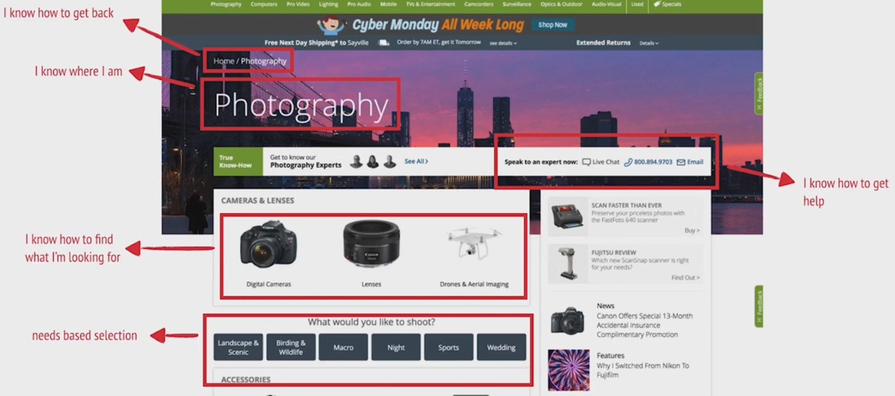

而不要讓使用者有這些疑問

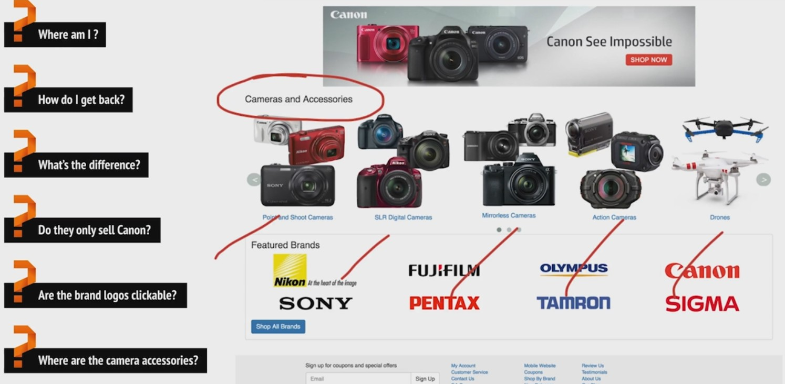

## 五秒測試（續）

1. 標題和副標題是最重要的
2. 如果有一段文字標示目前在做什麼，那它就應該是標題

## The Art of the CTA

** HAVE A FREAKING CTA **

1. CTA 要明顯，別讓使用者找它
2. 每頁理想要有一個 CTA
3. 用標題去支持 CTA
4. Attention ratio 要高
5. 不要用 "submit"，以使用的角度和心態，用"我想要..."這類的詞當 CTA
6. 要讓使用者知道會發生什麼事，要設定期望
7. 有劃定清楚的的 action block
8. 不要讓使用者填太多資訊

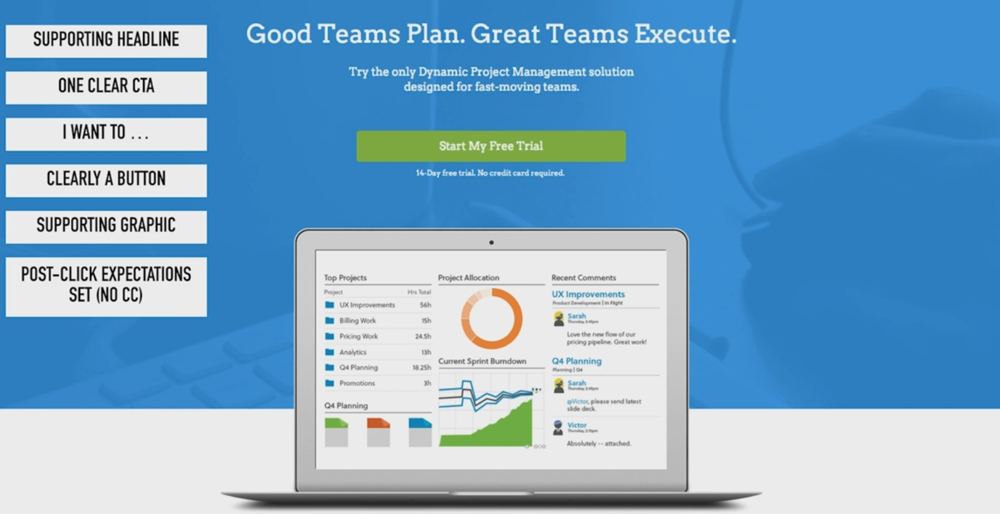

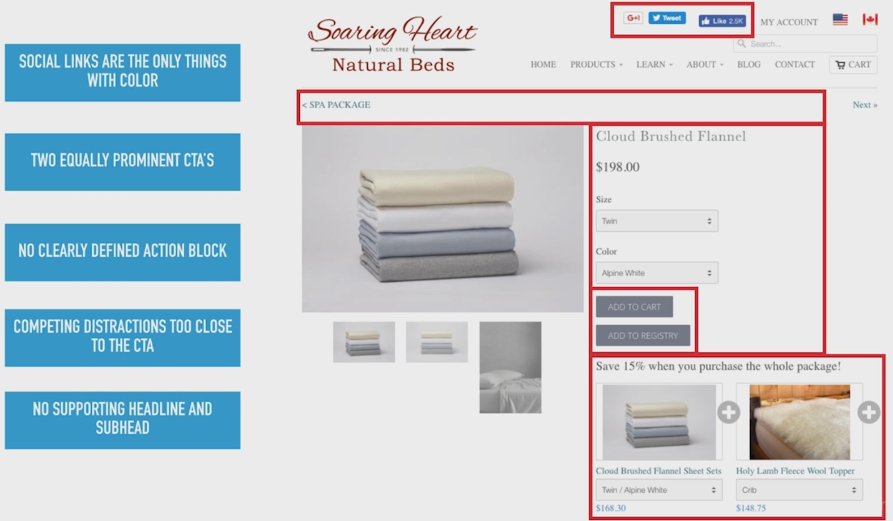

按鈕要明確

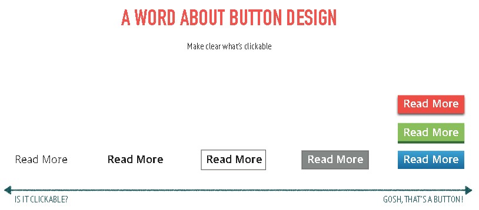

## Landing Page Readibility

最容易被搞砸的項目。根本原因在於設計者是以「使用者會看完我所有的文字內容」來設計的，但使用者在頁面上通常只會 scan 並試圖理解，如果可以理解，才會點擊你的 CTA。

> How users read on the web: they don't.

people glance and scan，直到找到與他們有關的關鍵處（特別在初期）。人們不 read 的原因在於忙碌，而且有其他選擇。Scaning 是我們找到與我們有關項目的方法。使用者會聚焦在那些符合他認為他正在找的東西。

1. Create visual hierarchies - the inverted pyramid
2. Use bullet points and highlight key terms
3. Short paragraphs. Very short.
4. Don't write full sentences
5. Use headlines on every page to give the user a sense of orientation
6. Avoid jargon and hyperbole...Fewer adjectives, more objectivity
7. Focus on essential information
8. Keep it simple 容易讀，不要用難理解的辭彙或字

## Respecting Web Conventions

User spend most of their time on other website

Convention 是使用者長期使用網站而習得的，要破壞 convention 一定要確定它可以不證自明，或是其背後價值可以彌補使用者的心力，唯一確定的方法是使用者實驗。

以下是一般主頁的 convention，dedicated LP 可能會省略很多地方，但位置和規則不變

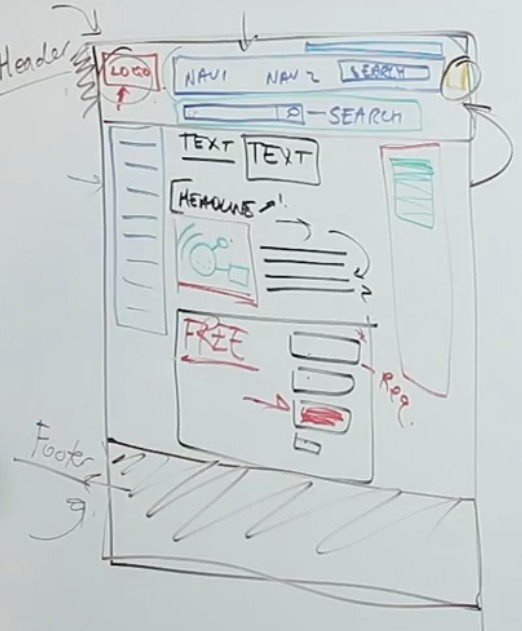

## Increase CR With Images + Graphics

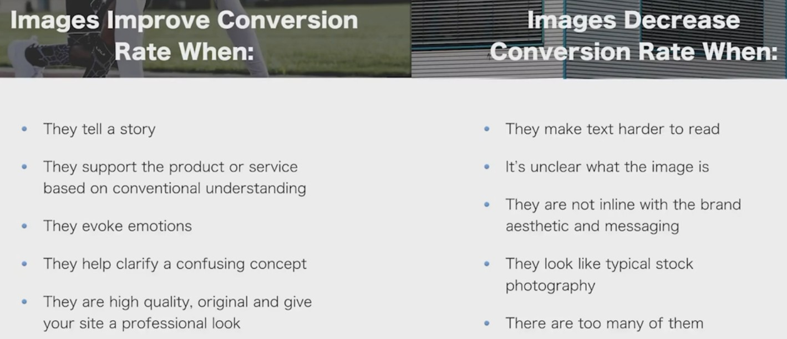

圖片設計技巧

1. Solid background container, with text on top of an image
2. Use **color overlay** to match brand style, reduce **brightness** and **complexity** of the image
3. Use solid black overlay with an opacity level of 80-95%
4. Position image and make text on a solid part of the overall image
5. Gradient overlay from transparent to solid fade over image
6. Blur background image enough to let text be prominent and clear

圖片要（而且也應該）能夠取代文字

Icon 和 thumbnail 應被用來創造結構感和組織感

如果 LP 中有些地方字太多，可以加一些輔助圖形把文字打散並且使文字較容易被吸收

在不同 row 間交換圖和文字的順序可以幫助建立結構

別忘了勾起使用者的情感

## Information Archetecture + Accessibility

### Archetecture

網站沒有方向，所以要做好導覽，以下各部講解看投影片。

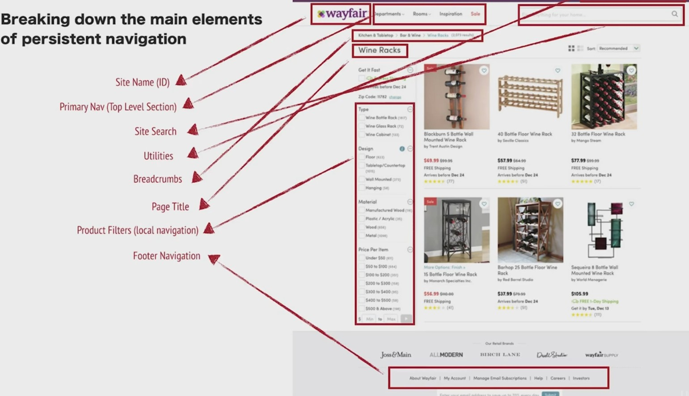

看自己的網站是否缺乏以下這些

1. Site name / Logo
2. Page name
3. Primary nav
4. Local Navigation
5. "You are here" visual distinction
6. Search

### Accessibility

1. Contrast, make sure you have lots of it.
2. Feedback, on-hover, on-click etc
3. Typography, sans-serif better than serif, don't use more thant 2 font families

## Trust Credibility + Safety

三個汽車網站顯示使用者雖然不知技術細節，但這些細節影響著我們對網站的信任感。

以下是一些可以增進信任感和安全感的東西

1. Transactional assurances: demo and free trial are most popular
2. Guarantees and policies
3. Safety logos
4. Clients and media

The **many**, the **comparable**, testimonials, social identity

Many and comparable 的旅館例子：問旅客要回收毛巾或是要新的毛巾。控制組說是**為了環境並與我們合作**，38%的旅客會回收。變數一說**與我們合作並加入這個計畫**，36%的旅客回收（因為是感覺是旅館要，而旅客沒有任何好處），變數二說**大多數的人會回收毛巾**，46%會回收（這邊用到了 the many），變數三說**大多數住在這間房間的人會回收毛巾**，54%人會回收（因為有 comparable）。

## Dedicated Landing Page Best Practice

1. Clear and Unmistakable Headline
2. Action Block / CTA Above The Fold
3. Remove any Excess Text and Highlight Primary Features
4. Trust, Trust and a Little More Trust
5. Explainer Videos Work Great on Landing Pages
6. Split up long forms to only include key fields on the first page
7. Consistent Messaging From The Upstream Click

測試順序

1. Headlines
2. Form Fields
3. Offers / Promotions
4. CTA Text
5. Images / Video

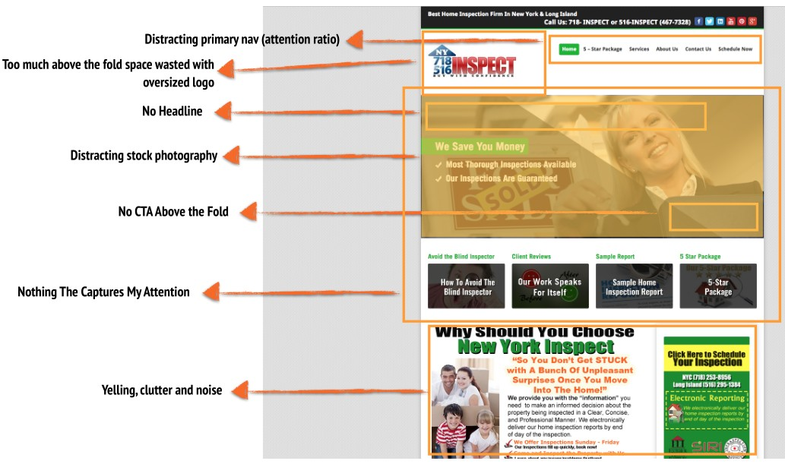

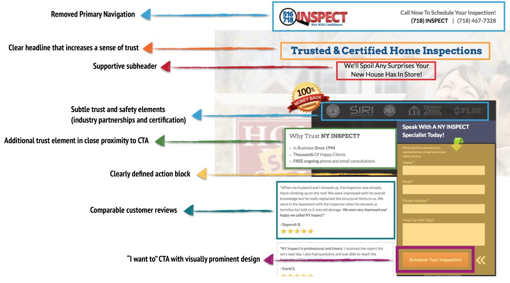

# Principles of Persuasion

## Scacity

- 限量是殘酷的，人們傾向做倉促的決定多過錯過一筆交易
- 商品可以是實體物品促成導引性銷售，可以是限時或限量
- Don't overdo it

## Reciprocity (互惠報答）, Reciprocal Concessions （讓步） + Anchoring

- 人在潛意識比較不會對第二選項（後來提出，較佳的條件）說不，以在別人庭院放大小招牌，和小孩提出的五元要求為例
- 以研討會的早鳥票和一般票為例
- 寄信提供折扣
- Create a second package with additional features not usaully important to the majority of your customers
- Yes / No exti-intent popovers

### Reciprocal concessions + Anchoring

- 在 decision making 中，anchor 指的是第一個或是最圖出的選項
- 人傾向過度依賴 anchor，接下來的選項皆會以 anchor 為基準來評量
- 最常用在訂定價格上
- 可以放上你根本也不打算銷售的東西

善用 anchoring 提高產品利潤的例子。這是講者做的實驗。**實際上，即使是一模一樣的產品，一樣的真實售價，在有提供 anchoring 的情況下，已經多次證明比那些沒有提供的有較高轉換率**。

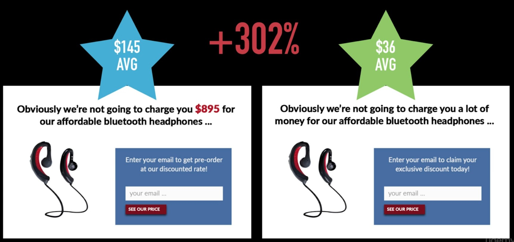

### Engendering indebtedness （產生受惠感）

- 人們傾向回報你的恩惠
- 實驗，在結帳前提供客人糖果或巧克力，小費就有明顯不同
- Don't ask for anything in return
- Free advice, free tools, trials, content previews, free resources, ebooks and white-papers, consultations, audits and additional perks are all gestures that will create a desire to reciprocate

**提供恩惠並不僅僅造成增加銷量，而是在潛意識引發客戶想要回報的心理。**舉線上販售眼鏡為例，提供無償退貨，免運，五天試用，還有精美木盒，客戶傾向於回報商家。

- Don't underestimate the resource library （以我自身為例，會去看 launch school 的書）

### Cognitive Dissonance Theory (認知失調論) Works Well With Riciprocity

- 人們傾向不矛盾。他們要他們的行為和信念是相符的
- 我們合理化並且作為使它們不違背先前的行為和努力
- **以此課程為例，我更有可能向講者的 Landing page 課程買單，因為我從這門課得到價值，而且沒有付出太多錢，因此會更傾向回報講者。這不是說服，靠說服是沒有用的。而是一旦我自己決定要，我就會去找那些對自己有價值的事物。**
- 一個潛在顧客愈 engage 你的網站，他愈容易有忠誠度，並向你買東西
- 可以用在標題
- 總是用在正面的地方，使人自我感覺良好

以下是一個利用 cognitive dissonance 的好例子，人們很難按下 No，因為那跟他們一直想做的事相反。 人們不喜歡行為和認知相反，投影片有更多利用弱點的經典例子。

## Empathy and Contextual Awareness

Walk in their shoes.

看投影片。

Practice: Write user scenarios, role, the trait and intent of conversion path. Close eye, imagine you're that person, feel the fear, anxiety, motivation, need for more information to get your question answered. Go back your site, experience the site with sense of empathy from the prospetive of your user scenarios.